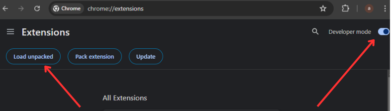
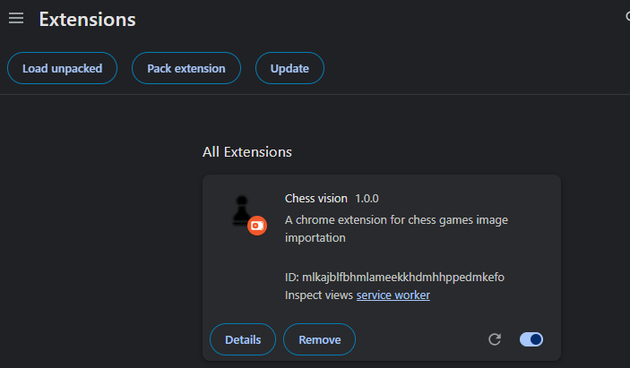

# Chrome Extension Setup

## Installing Dependencies

In the root directory of the project, run:

```bash
npm install
```

This will install all the necessary dependencies for your Chrome extension.

## Loading the extension in your browser

To build and load the extension follow these steps:

1. Build the extension:

- Run the following command to build your extension:

```bash
npm run build
```

This will populate the dist folder with the built files. 2. Load the Extension in Chrome:

- Open Chrome and navigate to `chrome://extensions`.
- Ensure that Developer mode is enabled (toggle in the top right corner).
- Click on Load unpacked.
  
- Navigate to your extension folder and select the `dist` directory.
  
- Once you get the extension here you're ready to go.

## Demo
